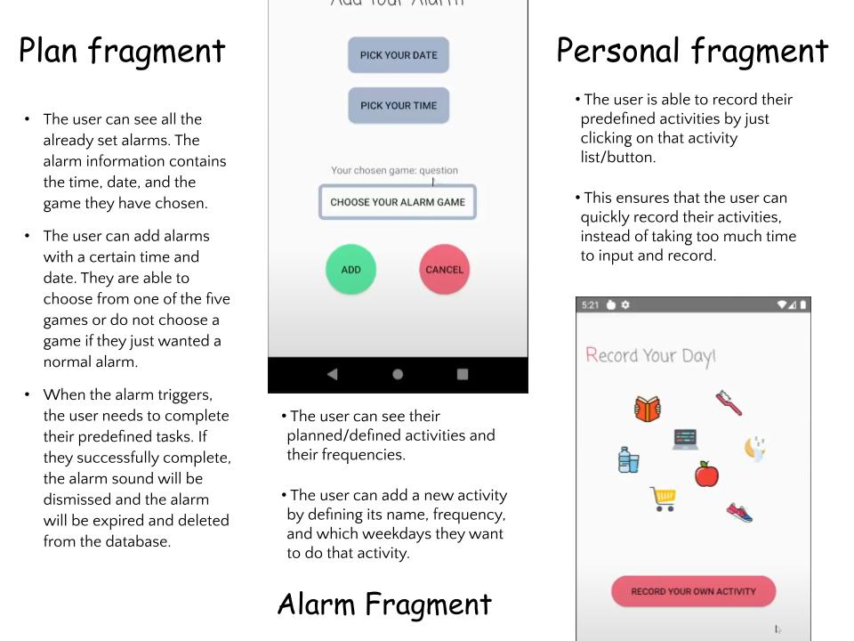

# AAlarm

## App Demo
Alarm: [Alarm portion demo video link (Google Drive)](https://drive.google.com/file/d/1zGzF5uN1SDOdJLcdunZJI61WusG3sa6B/view?usp=sharing)
Lifestyle: [Lifestyle portion demo video link (Google Drive)](https://drive.google.com/file/d/1-M75ImIl9A0t12_isB4BWSrxRTirIb1z/view?usp=sharing)
Poster: [Presentation poster slidse (Google Slides)](https://docs.google.com/presentation/d/1RVm-ij6a_X6Z68pQvd9DCD-novN3zIyn/edit?usp=sharing&ouid=116762766128821711981&rtpof=true&sd=true)

## App Introduction

The main problems the app is trying to solve are procrastination and forgetfulness. In our daily lives, we often lack the motivation to do the tasks that we may need to do and we procrastinate. For example, we might sleep in but we planned to get up at 8 to do homework. We may be playing mobile games for too long and are reluctant to put the phone down to focus on other important tasks. On top of that, we may also forget to do some tasks and need a reminder. For instance, we may forget to drink water enough times and stay hydrated every day. We may take some medicine a few times a day and forget to take it enough times a day. All people who have similar issues can be the natural users for this app.

## Design and Implementation

For the alarm portion of our app, the user can define alarms at certain times. When the alarm triggers, the user needs to complete a task they have chosen, including solving a math problem, scanning a QR code, shaking their phone, solving a trivia question, and typing out a random string verbatim. The alarm sound is only dismissed if the user completes their task. The benefit of this is that, for example, the person has a habit of sleeping in and missing important things. By doing this, the user should be sober enough to be awake and carry out their daily activities and routine.

For the lifestyle portion of the app, the user can define their activities, select their frequencies, and select which weekdays they want to perform that activity. Then, if they complete their predefined activity once, they can record their action very conveniently in the app just by clicking on a button. For each day, if they did not complete the activity enough times compared to what they have defined, then the app will send a notification to remind them of certain incomplete activities.

The application has three fragments: Alarm, Plan, and Personal. We used SQLite databases for storing the information about the alarms, user defined activities, and user recorded activities.

For the Alarm fragment:
- The user can see all the already set alarms. The alarm information contains the time, date, and the game they have chosen.
- The user can add alarms with a certain time and date. They are able to choose from one of the five games or do not choose a game if they just wanted a normal alarm.
- When the alarm triggers, the user needs to complete their predefined tasks. If they successfully complete, the alarm sound will be dismissed and the alarm will be expired and deleted from the database.

For the Plan fragment:
- The user can see their planned/defined activities and their frequencies.
- The user can add a new activity by defining its name, frequency, and which weekdays they want to do that activity.

For the Personal fragment:
- The user is able to record their predefined activities by just clicking on that activity list/button.
- This ensures that the user can quickly record their activities, instead of taking too much time to input and record.

## Unique or Customized Features

1. 3D interaction and sensor access (Accelerometer): “shake the phone”
2. Camera access
3. Our app designed based on portable devices and can record information at any time
4. Customized alarm. The alarm plays a ringtone and takes the user to their predefined game when triggered. Getting this alarm functionality to work took some time and effort. Perhaps because of the fact that a default alarm already exists in Android phones, the API for scheduling alarms on Android is not documented very well. We used a combination of intent, pending intent, alarm manager, broadcast receiver, and media player to achieve this functionality.
5. Refined User Interface：layout, button, imageView, font
6. Restrictions on some system feature, including prohibiting copying, prohibiting volume adjustment
7. Get permission for Camera uses to scan various QRcodes
8. More customization and implementation on SQLiteDB, including defining schemas and writing more queries.
9. More implementation about Lab9 sensor: “shake the phone”

